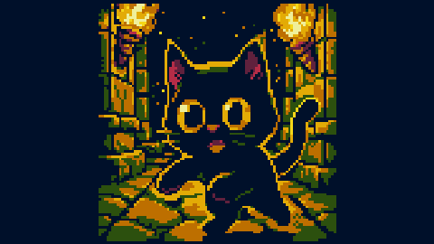
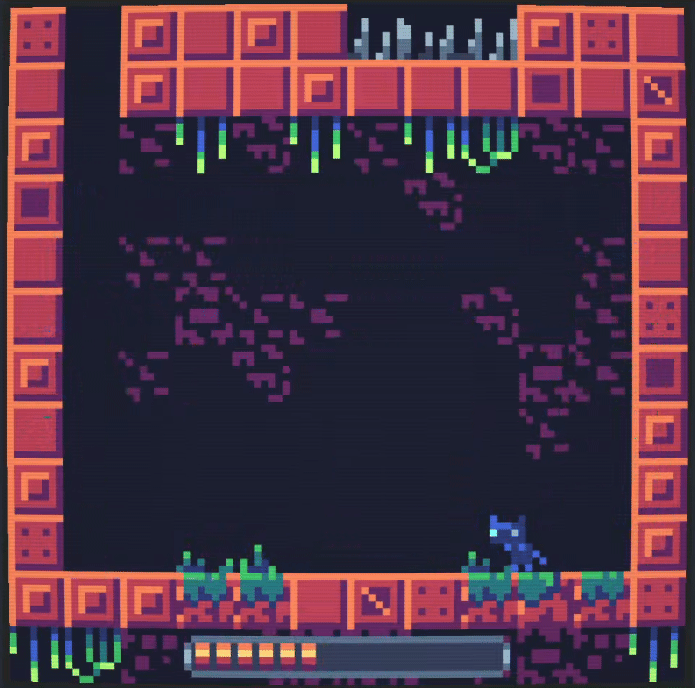
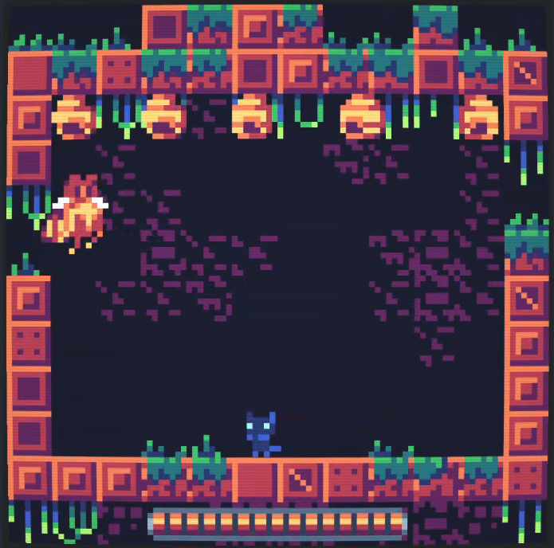
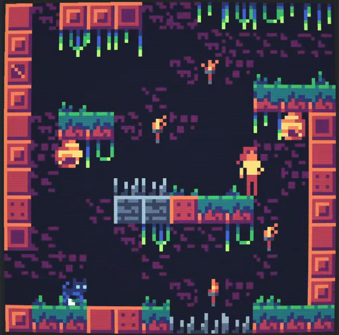

# Biralo: Beyond

---

**This is an extended and enhanced version of my original game-jam entry for JS13kGames 2025.**
 The theme: **"Black Cat"**

**A tribute to the fearless few who choose 'Hard Mode' first and never look back.**

Rebuilt from the ground up in **Godot 4.5x**, this version squashes bugs, sharpens mechanics, and answers the call of player feedback.
 I’ve packed in **new levels**, a **menacing boss**, and a bunch of other cool surprises to keep you on your toes.

I had an absolute blast crafting this beast and I hope you’ll have just as much fun surviving it.

---
The original jam version is available here: [https://github.com/smiley405/biralo](https://github.com/smiley405/biralo)

## 🛠️ Tools Used

- [Grafx2](http://grafx2.eu/) – Arts and animation
- [spritesheet-viewer](https://github.com/smiley405/spritesheet-viewer) – Previewing animation and exporting spritesheets
- [bxfr](https://github.com/increpare/bfxr2) – Sound effects
- [Godot 4.5.1](https://godotengine.org/) – Game engine

---

## 🎵 External Game Music

- [nene – Boss Battle #3 V2](https://opengameart.org/content/boss-battle-3-8-bit-re-upload)
- [Memoraphile – Spooky Dungeon](https://opengameart.org/content/spooky-dungeon)
- [Kat – Casual 8-bit](https://opengameart.org/content/casual-classic-loop-8-bit)

---

## 📸 Screenshots

 

 

 

